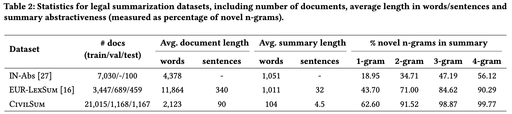

# Legal Document Summarization with CivilSum

[](https://github.com/ra-MANUJ-an/SIGIR-2024/blob/main/LICENSE)
[](https://creativecommons.org/licenses/by-nc-sa/4.0/)
[](https://www.python.org/downloads/release/python-388/)

Dataset and code for the paper "CivilSum: A Dataset for Abstractive Summarization of Court Decisions" which appears in [SIGIR 2024](https://sigir-2024.github.io/index.html).

## Introduction

We provide both the code base and the dataset used in the research, aiming to facilitate the exploration and evaluation of legal document summarization methods. Our contribution includes the introduction of *CivilSum*, a comprehensive collection of 23,350 legal case decisions from the Supreme Court of India and other Indian High Courts, paired with human-written summaries. *CivilSum* stands out not only for its larger volume of legal decisions but also for providing shorter and more abstractive summaries, setting it as a challenging benchmark for legal summarization.



## Dataset

To download the data, use the following links:

| Data split | # samples |
|--------------|-----------|
| [train.csv](https://drive.google.com/file/d/1WX5w-ClK82Yy916350bRp3hcuqab1D-x/view?usp=sharing) | 21,015    |
| [validation.csv](https://drive.google.com/file/d/1khcDFSca6zUv-dFQ4XaxMt8jRf-9PZbV/view?usp=sharing) | 1,168    |
| [test.csv](https://drive.google.com/file/d/1v0EM35CFWxFPc5D4bFxpf59mV_kEv0pw/view?usp=sharing) | 1,167    |


## Summarization Experiments

The `experiments` folder contains scripts for reproducing the summarization experiments using [Longformer](https://arxiv.org/abs/2004.05150), [FactorSum](https://aclanthology.org/2022.emnlp-main.426/), and [Llama-2](https://arxiv.org/abs/2307.09288).

## Copyright Information
In accordance with the provisions of the Indian Copyright Act, 1957, it is affirmed that the judicial pronouncements are readily accessible and can be accessed through the [website](https://indiankanoon.org) by conducting a search using the name of the specific case. It should be noted that the headnotes or summaries of these judicial pronouncements are protected under the Indian Copyright Act, 1957, with copyright belonging to Copyright © 2016 [Patiala Law House](https://patialalawhouse.blogspot.com/).

Furthermore, this dataset's license is restricted to specific purposes such as conducting academic or educational research or study. It should be duly acknowledged that the utilization of the judicial pronouncements from the aforementioned website is carried out within the confines of the license provided, and thus does not infringe upon the provisions set forth by the copyright act. 

We release our corpus under the [CC BY-NC-SA 4.0](https://creativecommons.org/licenses/by-nc-sa/4.0/) license.

## Citation
```
coming soon
```
